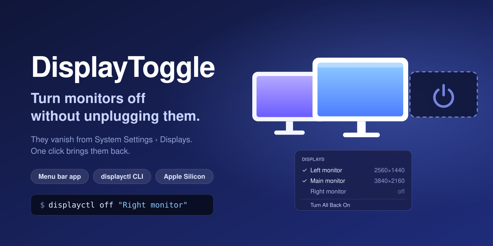
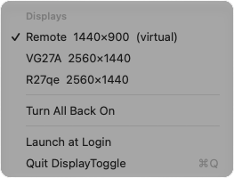

<p align="center">
  
</p>

<h3 align="center">Disconnect external monitors on your Mac without touching a cable.</h3>

<p align="center">
  <a href="https://github.com/tensarflow/DisplayToggle/releases/latest"></a>
  
  
  <a href="https://github.com/tensarflow/DisplayToggle/actions/workflows/ci.yml"></a>
  <a href="LICENSE"></a>
</p>

DisplayToggle switches a monitor off **in software**. macOS stops treating it as
connected: it disappears from **System Settings › Displays**, your windows move to the
screens that are left, and the cable stays plugged in. Click again and it's back.

It's the "disconnect" trick BetterDisplay made popular, as a tiny, free, open-source menu
bar app **plus a `displayctl` command** you can script.

<p align="center">
  
  <br>
  <sub>The real menu, with two monitors switched off.</sub>
</p>

## Why you'd want this

- **Remote in without lighting up your desk.** Working over RustDesk, Screen Sharing,
  Parsec or Jump Desktop? Switch the physical monitors off so nothing shows on them, and
  keep your windows on the screen you're actually looking at.
- **Stop windows wandering to a screen you can't see.** A monitor that's merely powered
  off is still connected as far as macOS is concerned. New windows, dialogs and your cursor
  can still end up there.
- **Focus mode.** Drop to one screen for deep work, without crawling behind the desk.
- **Awkward hardware.** Monitors with hidden or missing power buttons, docks and KVMs you
  don't want to unplug.
- **Automation.** It's one shell command, so it fits Shortcuts, Raycast, Alfred or cron.

## Features

| | |
|---|---|
| 🖥 **Really disconnected** | Gone from System Settings › Displays and the display arrangement, not just black or mirrored. |
| 🖱 **One click** | A menu bar icon with a checkmark per monitor. |
| ⌨️ **Scriptable** | `displayctl list`, `off`, `on`, `on --all`, by ID or by name. |
| 🛟 **Safe by default** | Refuses to switch off your last screen, warns when only a virtual (remote-desktop) screen would be left, and a restart, logout or replug brings everything back. |
| 🪶 **Tiny** | One 220 KB binary. No dependencies, no background daemon, no network access, no telemetry. |
| 🔓 **Open source** | MIT licensed, about 450 lines of Swift you can read over a coffee. |

## Install

### Download

1. Get **DisplayToggle.zip** from the [latest release](https://github.com/tensarflow/DisplayToggle/releases/latest),
   unzip it and drag **DisplayToggle.app** into Applications.
2. Open it. The app isn't notarized, so macOS will say it can't verify the developer.
   Go to **System Settings › Privacy & Security**, scroll down and click **Open Anyway**.
   You only have to do this once.
3. Optional, for the command line:
   ```bash
   mkdir -p ~/.local/bin
   ln -sf /Applications/DisplayToggle.app/Contents/MacOS/DisplayToggle ~/.local/bin/displayctl
   ```
   Make sure `~/.local/bin` is on your `PATH`.

### Build from source (no Gatekeeper prompt)

You need Xcode 16 or later, or the Command Line Tools (`xcode-select --install`).

```bash
git clone https://github.com/tensarflow/DisplayToggle.git
cd DisplayToggle
./install.sh
```

This builds the app, puts it in `~/Applications`, links `displayctl` into `~/.local/bin`
and starts it.

## Use it

### Menu bar

Click the two-monitor icon. A checkmark means the monitor is on; click a monitor to flip
it. **Turn All Back On** appears whenever something is off, and **Launch at Login** keeps
the icon around after a restart.

### Command line

```console
$ displayctl list
ID  NAME    STATE  KIND      RESOLUTION  MAIN
7   Remote  on     virtual   1440x900    yes
1   VG27A   on     physical  2560x1440
3   R27qe   on     physical  2560x1440

$ displayctl off r27
R27qe is off.

$ displayctl on --all
R27qe is on.
```

| Command | What it does |
|---|---|
| `displayctl list` | Show every monitor, on or off |
| `displayctl off <id or name>` | Disconnect a monitor |
| `displayctl on <id or name>` | Reconnect it |
| `displayctl on --all` | Reconnect everything DisplayToggle switched off |

A name can be any unique part of the monitor's name, in any case. The ID from `list`
always works.

### Shortcuts, Raycast and friends

Anything that runs a shell command can drive it:

- **Shortcuts:** add a *Run Shell Script* action with `~/.local/bin/displayctl off VG27A`,
  then give the shortcut a keyboard shortcut or pin it to the menu bar.
- **Raycast or Alfred:** a script command that runs `displayctl on --all`.

## FAQ

**Does a monitor stay off after a restart?**
No, on purpose. A restart, logout or unplugging the cable brings it back. That's the
safety net: you can't end up with a Mac whose screens stay off.

**What if I switch off every physical monitor while I'm remoted in?**
DisplayToggle asks before doing that. If the remote session then ends, the Mac has no
screen until you connect remotely again (then use the menu) or restart it, for example
with `sudo shutdown -r now` over SSH. Every monitor comes back after a restart.

**Is this a BetterDisplay alternative?**
For this one feature, yes. BetterDisplay is a much bigger (and excellent) display toolkit,
with HiDPI scaling, virtual screens, brightness control and more. If all you want is to
switch monitors on and off, DisplayToggle does just that, for free, in the open.

**It uses a private API. Is that safe?**
It's the same call BetterDisplay uses (`SLSConfigureDisplayEnabled`). DisplayToggle never
talks to the monitor's firmware and never saves display preferences; the change lives only
until your next logout. If a future macOS removes the call, DisplayToggle shows an error
instead of doing anything.

**Why does macOS say it can't verify the developer?**
Notarizing needs a paid Apple Developer ID. Build from source and macOS won't ask.

**Intel Macs?**
Not supported. Telling physical and virtual screens apart relies on the Apple Silicon
display driver. The core trick may still work on Intel, but it's untested.

## How it works

DisplayToggle opens a normal CoreGraphics display-configuration transaction, flips the
display's enabled flag through SkyLight's `SLSConfigureDisplayEnabled`, and commits it for
the current session only. Because a disconnected monitor vanishes from every public display
list, the app remembers what it switched off in
`~/Library/Application Support/DisplayToggle/disconnected.json` so it can bring it back.
[docs/DESIGN.md](docs/DESIGN.md) has the details and a map of the code.

## Uninstall

Switch off **Launch at Login** in the menu first, then:

```bash
pkill -x DisplayToggle
rm -rf ~/Applications/DisplayToggle.app /Applications/DisplayToggle.app ~/.local/bin/displayctl
rm -rf ~/Library/Application\ Support/DisplayToggle
```

## Contributing

Issues and pull requests are welcome. `swift test` runs the unit tests and `./build.sh`
builds the app bundle.

If DisplayToggle saved you a trip under the desk, a ⭐ helps other people find it.

<sub>MIT © tensarflow. Not affiliated with Apple or BetterDisplay.</sub>
